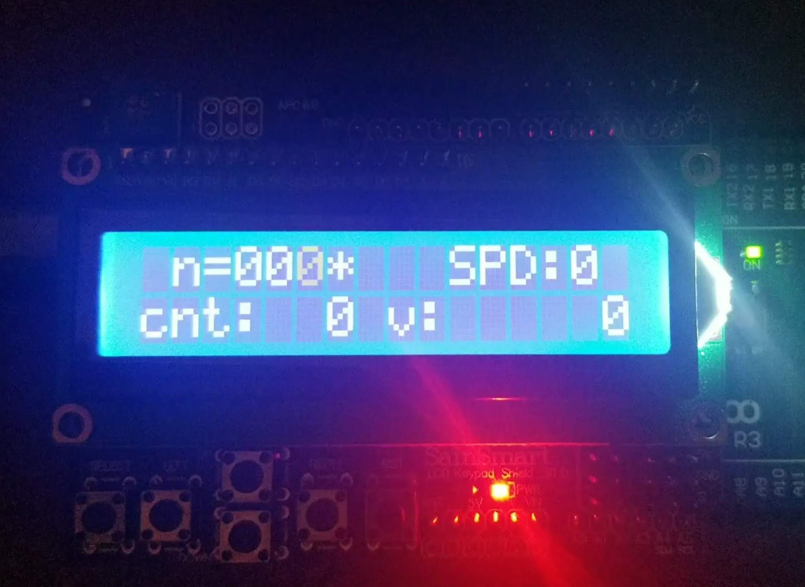

# CSC225-collatz

An interesting comparison of two different programing languages. Both of these programs work identically. 
The only difference is one implementation is in C and one is in assembly. They are both written to work 
on the arduino ATmega2560. 

The user can select the starting number and the speed and then watch the collatz sequence play out on the
lcd display. They can also pause the playback and/or change the speed of the playback while the sequence 
is playing out. On bootup is displays a quick welcome message then goes to the selection screen.

